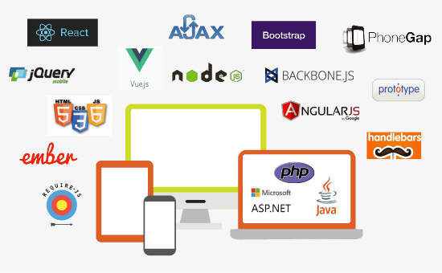

# [QuickOut](https://quickout.mynisum.com/) 

QuickOut Framework is a well engineered solution taking the "Mobile First" approach with horizontal scalability, while using the latest UI frameworks and technologies. It provides buyers with a fast, simple and error-free checkout process that minimizes confusion and maximizes the value of the customer experience. Retailers can switch between multi-page, single-page or any other layout with the click of a button, as different users and different devices demands the layout that suits them. 

# Changelog

Detailed changes for each release are documented in the [release notes](./CHANGELOG.md).

# Architecture & Technology

The architecture is build on the latest and greatest technologies leveraging cloud, mobile and big-data. It is build with a combination of UI technologies to provide the best user experiece possible while also providing the highest possible customization to retailers.

# Documentation

To check out [live demo](https://quickout.mynisum.com) 

## Installation

### Environment Setup
- Install JDK8
- Install MySQL
- Install Nodejs
- Install angular-cli using npm (npm install -g @angular/cli@latest)
- Install Maven
- Install Tomcat
- Checkout the source code from the git repository
- Open create_db.sql  under folder (api-services/src/main/resources/dbscripts/mysql/) and comment out the SQL statements where % is present. Run the script. this will create database and 'quickout' user with 'quickout' password.
- Next, run the quickout-schema.sql to create the tables. The database is now ready.
- Remove ROOT folder from tomcat webapps folder
- Copy ROOT folder comes with source code into webapps folder. 
- Goto ui/angular directory
- Run "npm install" command
- Run "ng build --prod" command
- cp -r dist/* tomcat/webapps/ROOT/
- Goto api-services folder
- Run run.sh script. (./run.sh)
- Start tomcat
- Open up your browser and type http://localhost:8080 in URL

# Examples

## How to create USlice
QuickOut provides quick and easy way to create new uslice. You can new uslice either in existing or new layout. Following are how to create new uslice:
- Goto ui/angular folder and run below command
- ng generate <New_Uslice_Name> component uslices 
- Above command will create new uslice under ui/angular/src/app/components/uslices folder

## How to create layout
You can easily create new layouts using following steps
- Goto ui/angular folder and run below command
- ng generate <New_Layout_Name> component layouts 
- Above command will create new uslice under ui/angular/src/app/components/layouts folder

## How to use Apple Pay USlice
QuickOut comes with builtin apple pay uslice which you can use in your layout. However you have to configure couple of certificates with your apple developer account. Follow this [link](https://developer.apple.com/videos/play/tutorials/configuring-your-developer-account-for-apple-pay/) to configure apple pay certificates.

# Roadmap

We've shared our vision and priorities for this project in our roadmap.

# Questions/Issues

For questions, support and issues please use opensource@nisum.com

# License

React is [MIT licensed](./LICENSE.txt)
